# 春 Haru

**A calm kanban workspace for busy minds.**

  

Haru is a soft, minimal productivity app built for people who need structure without overwhelm. Five workflow columns, a built-in Pomodoro timer, a Today's Focus panel, and smart nudges — all in a single HTML file that works entirely offline.

No accounts. No backend. No dependencies. Just open it and work.

---

## What it does

Haru gives you a full workflow system without the noise of traditional project management tools. Tasks move through five stages — from raw idea to completion — while the app quietly surfaces what actually matters today.

The Pomodoro timer links directly to tasks, so every focus session has a purpose. A smart nudge bar watches for blockers, overloaded work queues, and tasks that have been sitting idle — and gently surfaces them when it matters.

---

## Features

**Kanban Board**
- Five columns: Backlog · Not Started · In Progress · Blocker · Complete
- Asymmetric column widths — In Progress gets the most space, by design
- Drag and drop between all columns with a soft ghost placeholder
- Priority shown as a colored left border (High / Medium / Low)
- Each column has its own color accent and atmospheric tint

**Task Cards**
- Title, notes, due date, priority, energy tag, progress bar
- Blocker reason field (shown only when Blocker column is selected)
- Check to complete with a bloom burst + sparkle animation
- Context menu (⋯) for quick edit, move, and delete

**Today's Focus Panel**
- Left sidebar that auto-surfaces: due today, active work, blockers, high priority
- Greets you by time of day
- Quick-add field at the bottom — one Enter key captures a thought to Backlog

**Pomodoro Timer**
- Three modes: Focus (25 min), Short Break (5 min), Long Break (15 min)
- Circular countdown ring — rose for focus, sage for breaks
- Session dots track completed work blocks
- Link any active task to the current session
- Browser tab blinks when time's up

**Smart Nudges**
- Pure JavaScript logic — no AI, no API
- Detects: blocked tasks, too many active tasks, stale tasks (3+ days untouched)
- One gentle message at a time, dismissible

**Environment Controls**
- Energy mode selector: 🌙 Low · ☕ Medium · ⚡ Focus · 🎨 Creative
- Motivational text shifts with each mode
- Light and dark mode — warm cream vs. midnight café
- Focus Mode dims all columns except In Progress
- Search filters tasks instantly across all columns

**Persistence**
- Everything saves to `localStorage` automatically
- Tasks, theme, energy mode, and focus state survive refresh and browser close

---

## Philosophy

Most productivity tools are built for teams, dashboards, and managers. Haru is built for the person with too many tabs open and not enough headspace.

The constraints are intentional — a single file means no install, no login, no sync issues. The soft aesthetic isn't decoration; it's a deliberate choice to make the workspace feel less like a control panel and more like a desk you actually want to sit at.

> *Small progress still blooms.*

---

## Usage

1. Download `haru.html`
2. Open it in any browser
3. Start adding tasks

That's it.

---

## Technical notes

- Vanilla HTML, CSS, and JavaScript — no frameworks, no libraries, no CDN
- Single self-contained file
- CSS custom properties handle the full theming system (light + dark)
- Drop zones use a clone-swap pattern to reliably clear and re-register event listeners on each render
- `localStorage` keys are namespaced (`bf3t`, `bf3p_*`) to avoid collisions

---

## Project artifacts

| Artifact | Description |
|---|---|
| `haru.html` | The full application |
| `haru-wireframe.html` | Lo-fi product wireframe document |

---

*Built with care. Designed with restraint.*
