# 栞 Shiori

  

**One task at a time.**
 
Shiori (栞) is the Japanese word for a bookmark — something small that quietly holds your place so you can pick up right where you left off, without pressure. That's the whole idea behind this app: a personal kanban board that doesn't shout at you.
 
Most productivity tools are built to make you feel behind. Dense grids, notification badges, streak guilt, a hundred features you never asked for. Shiori is the opposite bet — a calm workspace that only ever asks one question: **what should I work on next?**
 
There's no login, no server, no account, no sync service quietly farming your data. It's a single HTML file. You open it, you use it, it remembers everything on your own machine, and that's the entire product.
 
---
 
## Philosophy
 
- **Peaceful over powerful.** If a feature would make the interface feel busier, it's probably not going in.
- **Yours, entirely.** No backend, no telemetry, no dependency on anyone else's servers staying up. Your tasks live in your browser's storage, on your device, full stop.
- **Slow interface, fast thinking.** Muted colors, restrained motion, soft edges — the app should never compete for attention with the work itself.
- **One next action.** Every task can hold a single "next action" — because the hardest part of a task is rarely the whole thing, it's knowing the very next step.
---
 
## Features
 
**Board**
- Seven columns: Inbox → Backlog → Ready Next → In Progress → Waiting → On Hold → Completed
- Drag and drop between columns, collapsible columns, pinned tasks
- Priority shown as a soft color accent, never a loud badge
**Task panel**
- Slides in from the side instead of popping up over your work
- Title, description, priority, status, due date, tags, next action
- Checklist with drag-to-reorder and a progress bar
- Freeform notes, linked resources, and a running history of what changed and when
**Dashboard**
- Today's focus, what's due, what's overdue, what's waiting, what's in progress, what you finished today
- A single circular progress indicator instead of a dozen charts
- A rotating, quiet reminder that it's fine to take a tea break
**Notes**
- Simple, auto-saving, markdown-style freeform notes — no separate save button, ever
- Optionally link a note to a task; a small chip takes you straight to that task's panel
**Search & filters**
- Instant search across titles, descriptions, notes, checklists, and tags
- Filter by priority, tag, due today, this week, or completed
- A search or filter with no matches reads clearly as "no matches," never as "no tasks"
**Data**
- Everything saves automatically to `localStorage`
- Export the whole thing to JSON, import it back, or reset entirely
- Undo on delete, on column moves, and on clearing completed tasks — nothing is ever permanently gone by accident
**Keyboard shortcuts**
 
| Key | Action |
|---|---|
| `N` | New task (quick add) |
| `/` | Focus search |
| `Esc` | Close panel / quick add |
| `⌘/Ctrl + S` | Export data |
| `Space` | Toggle a focused checklist item |
 
---
 
## Getting started
 
There's no install step.
 
1. Download `shiori-v4.html` (the current version)
2. Double-click it (or open it in any modern browser)
3. Start adding tasks
Your data stays entirely in that browser's local storage. If you switch browsers or devices, use **Settings → Export** to move your data over via the JSON file, then **Import** it on the other side.
 
---
 
## Tech
 
- Vanilla HTML, CSS, and JavaScript — no frameworks, no build step, no npm
- Zero external dependencies or CDN calls — the file works completely offline
- Everything lives in one `.html` file by design, so it's as portable as a bookmark
---
 
## Versions
 
| Version | What changed |
|---|---|
| v1 | Original build — warm neutral palette (soft paper / charcoal), full feature set |
| v2 | Palette pass — pastel periwinkle, dusty pink, and muted gold instead of the original neutrals |
| v3 | Polish pass on v2 — refined type scale, a breathing progress ring, softer motion throughout. No new features |
| **v4** | **Current.** Usability pass — undo extended to column moves and clearing completed, a first-run nudge on an empty board, an Overdue count on the dashboard, clearer "no matches" states when searching or filtering, and optional note-to-task linking |
 
Earlier versions (`shiori.html`, `shiori-v2.html`, `shiori-v3.html`) are kept in the repo for reference — each is a complete, working snapshot of that stage. `shiori-v4.html` is the one to actually use.
 
Shiori has stayed feature-frozen in spirit across versions — most changes have been about making the same small tool feel calmer, clearer, and easier to trust, not about doing more.
 
---
 
## License
 
MIT — do whatever you'd like with it.
