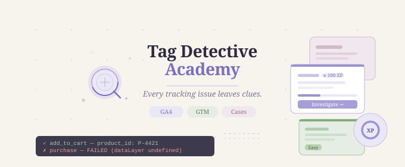

# 🕵️‍♂️ Tag Detective Academy

An interactive, gamified Learning Management System (LMS) and micro-app built around detective mystery cases. This tool replaces boring technical documentation with immersive, story-driven "Case Files" where users learn and test their **Google Analytics 4 (GA4)** and **Google Tag Manager (GTM)** skills by debugging real tracking implementations.

<p align="center">
  
</p>


## 🚀 Vision & Concept

In analytics engineering, a broken tag or a corrupted `dataLayer` is a crime scene. Users take on the role of a Junior Detective, guided by **Byte** — a floating chibi detective mascot — to inspect event logs, locate missing variables, and catch the technical culprits sabotaging client data.

- **Target Audience:** Beginner to Intermediate Analytics Practitioners, Developers, and Marketers.
- **Design Aesthetic:** Clean, premium, and playful — think modern SaaS meets detective noir. Indigo primary palette, soft card surfaces, dashed evidence boards, and terminal-style event logs.
- **Platform:** Mobile-First, Fully Responsive Web App.
- **Core Philosophy:** *"Every tracking issue leaves clues."* — Learning through mystery-solving creates retention that passive study never does.

---

## 🛠️ Tech Stack & Architecture

Designed as a zero-dependency, vibe-coding-friendly prototype:

- **Frontend:** HTML5, CSS3, Vanilla JavaScript (ES6+)
- **State Management:** In-memory JavaScript object (Phase 1) → `localStorage` persistence (Phase 2)
- **Animations:** CSS `@keyframes` for mascot float/blink, page transitions, and XP counters. HTML5 Canvas API for confetti bursts.
- **Fonts:** System serif (`Georgia`) for editorial warmth + `Courier New` monospace for terminal/code elements.
- **No frameworks. No build step. No dependencies.** Open the file and play.

---

## 📁 Project Structure

```
tag-detective-academy/
├── index.html          # The entire app — single self-contained file
├── wireframe.html      # Low-fidelity product wireframe & UX documentation
└── README.md           # This file
```

> **Why a single file?** The prototype is intentionally self-contained for maximum portability. Share it, email it, open it on any device — no server, no install, no internet required. The architecture is modular internally and ready to split into separate files for Phase 2.

---

## 🗂️ Internal Architecture (inside `index.html`)

```
index.html
├── <style>              # Full design system — variables, components, animations
├── Screen Markup        # 8 screen templates (hidden/shown via JS class toggling)
│   ├── #screen-welcome
│   ├── #screen-cases
│   ├── #screen-investigation
│   ├── #screen-challenge
│   ├── #screen-caseclosed
│   ├── #screen-academy
│   ├── #screen-achievements
│   └── #screen-profile
└── <script>
    ├── state {}         # Single source of truth for all app state
    ├── CASES []         # Case data — clues, event logs, challenges, summaries
    ├── ACADEMY_SECTIONS []  # Learning path structure and lesson metadata
    ├── ACHIEVEMENTS []  # Badge definitions and unlock conditions
    ├── Screen Router    # showScreen() — manages all navigation
    ├── Game Engine      # XP, ranks, clue selection, challenge evaluation
    ├── Render Functions # renderCases(), renderAcademy(), renderProfile(), etc.
    ├── Achievement System  # checkAchievements(), unlock()
    └── Confetti Engine  # Canvas-based particle burst on case completion
```

---

## 🕵️ The Cases

| # | Case Title | Difficulty | XP | GA4/GTM Concept |
|---|-----------|-----------|-----|-----------------|
| 001 | The Vanishing Purchases | 🟢 Easy | 100 XP | GA4 Events — missing `dataLayer` initialization |
| 002 | The Missing Conversion | 🟡 Medium | 175 XP | GTM Triggers — stale form ID condition |
| 003 | The Duplicate Event Mystery | 🔴 Hard | 250 XP | GA4 Config — dual tag installation |

### Case Loop

```
Pick Case → Gather Evidence → Analyze Event Log → Solve Challenge → Case Closed → XP + Learning Summary
```

Each case includes:
- **Evidence Board** — 6 clickable clue cards (mix of relevant and misleading)
- **Live Event Log** — terminal-style console output showing what actually fired
- **Byte's Hint** — contextual nudge from the mascot
- **Multiple Choice Challenge** — 4 options, 1 correct, 3 plausible distractors
- **Learning Summary** — 4 key takeaways that close the knowledge loop

---

## 🎓 Academy Learning Paths

| Path | Lessons | Status |
|------|---------|--------|
| GA4 Basics | 4 lessons | Available |
| Events & Parameters | 4 lessons | Available |
| Conversions | 3 lessons | Available |
| GTM Fundamentals | 4 lessons | Available |
| Triggers | 4 lessons | Available |
| Data Layer | 4 lessons | Unlocks at Analyst rank |

---

## 🏅 Detective Ranks

| Rank | XP Required |
|------|------------|
| 🔰 Rookie | 0 XP |
| 🔍 Analyst | 150 XP |
| 🕵️ Inspector | 400 XP |
| 🎩 Detective | 750 XP |
| ⭐ Senior Detective | 1,200 XP |
| 👑 Chief Inspector | 2,000 XP |

---

## 🗺️ Roadmap

**Phase 1 — Prototype (Current)**
- [x] 3 mystery cases with full evidence + challenge flow
- [x] XP system and 6-tier rank progression
- [x] 6 Academy learning paths with lesson unlock logic
- [x] 12 achievement badges
- [x] Byte mascot with context-aware hints
- [x] Fully offline, single-file deployment

**Phase 2 — Persistence & Expansion**
- [ ] `localStorage` for cross-session state persistence
- [ ] 5+ new cases (GTM Variables, Custom Dimensions, Attribution Models)
- [ ] Timer-based speed challenges and bonus XP
- [ ] Shareable rank cards and completion certificates

**Phase 3 — Platform**
- [ ] Backend API for dynamic case content
- [ ] Leaderboards and cohort learning
- [ ] Instructor dashboard for team-based learning
- [ ] Dark mode

---

## ♿ Accessibility

- Semantic HTML5 elements throughout
- Full keyboard navigation (Tab, Enter, Space)
- Visible focus rings on all interactive elements
- ARIA labels on clue cards and icon-only buttons
- Color is never the sole indicator — badges use color + text + shape
- WCAG AA contrast ratios maintained across all surfaces

---

## 📐 Wireframes

`wireframe.html` is a full low-fidelity product wireframe document covering all 8 screens. Built for:

- GitHub portfolio presentation
- Design reviews and stakeholder walkthroughs
- UX case study documentation

Includes sticky note annotations, UX decision rationale, system architecture diagrams, and information architecture notes. Open directly in any browser — no server needed.

---
