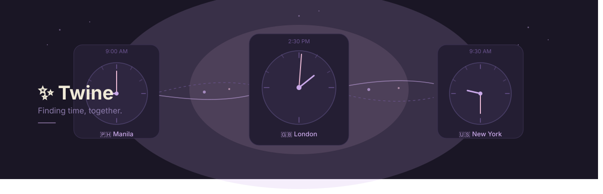

# 📆 Twine

**Finding time, together.**

Plan meetings across timezones without DST headaches.

A lightweight timezone meeting planner built with HTML, CSS, and Vanilla JavaScript.

---

  

## The Problem

I built Twine because I regularly schedule meetings with people across timezones and found existing tools frustrating to use. Most felt overly complicated, cluttered, or relied on basic UTC offset math that quietly breaks during Daylight Saving Time transitions — the kind of bug you don't notice until you've already double-booked someone an hour off.

I wanted a tool that removes the mental math and makes scheduling feel simple, visual, reliable, and a little delightful.

## The Solution

Twine helps you quickly find the best overlapping meeting time across multiple timezones. It focuses on:

- 🌸 Visual clarity over spreadsheets of offsets
- 🌍 DST-safe timezone conversion, verified against real edge cases (see below)
- 🤝 Smart meeting overlap recommendations, not a giant grid of every possible hour
- 🧠 Low cognitive load — you answer "when works for you," Twine does the rest
- 💜 A calm, friendly user experience

## Features

- 🌍 IANA timezone support across 344 cities in 5 regions
- ⏰ DST-aware conversions that pull live offset data from the browser, not hardcoded UTC math
- 🤝 Best meeting time recommendations, with a couple of quieter alternatives
- 📊 Visual 24-hour overlap timeline with day/night indicators
- 🌙 Dark and light mode
- 📱 Responsive, mobile-first design
- ➕ Multiple participant support, add/remove on the fly
- 📋 One-click copy of the agreed time across everyone's local timezone
- ♿ Accessible by default — semantic HTML, ARIA roles, visible focus states

### Tech Stack

* **Frontend:** HTML5, CSS3 (Custom Properties, Flexbox, Grid)
* **Logic & Data:** Vanilla JavaScript (ES6+), Native Browser `Intl` API
* **Architecture:** Zero-dependency, single-file HTML, 100% offline-first

> **Zero Overhead:** No frameworks. No build tools. No external dependencies. No CDNs. Open the `index.html` file in any browser and it works immediately.

## Technical Challenges

Building Twine taught me that timezone handling is a lot more complex than UTC math. Some of what came up:

- **Daylight Saving Time isn't a single global on/off switch.** The US and most of Europe both observe it, but on different dates — which means for a few weeks every spring, the usual 5-hour gap between New York and London briefly becomes 4 hours. I tested this exact window directly (scheduled a 9am NY meeting on a date inside that gap and confirmed the London time landed correctly) rather than assuming the math held.
- **Some countries don't observe DST at all, and the exceptions have exceptions.** Mexico abolished nationwide DST in 2022 — except Tijuana, which still follows it to stay in sync with California's clock across the border. Twine gets both right because it never special-cases a country; it asks each city's specific timezone identifier for its live offset.
- **DST runs backwards south of the equator.** Sydney's "summer" DST window is December–March, not June–September. Verified separately.
- **Not every timezone sits on a clean hour.** Kathmandu is UTC+5:45, Yangon is UTC+6:30. These aren't custom-handled — they fall out naturally from using the browser's real timezone database instead of writing offset math by hand, which is itself the lesson: the right move was knowing not to reinvent this.
- **Search breaks quietly on accented names.** São Paulo, Bogotá, and a dozen other cities in the dataset have diacritics. Typing the plain-ASCII version of the name — which is what most people actually type — originally returned zero results. Fixed by normalizing both the query and the data before matching.

Full verification notes, including the exact test inputs and outputs for each case above, are in [`TESTING.md`](./docs/TESTING.md).

## 🎯 Key Design Decisions

Twine intentionally prioritizes simplicity over feature count.

- **Browser-native timezone handling** — Uses the browser's IANA timezone database instead of maintaining timezone rules manually.
- **Meeting recommendations over giant grids** — Surface a few good options instead of overwhelming users with every possible hour.
- **Single-file architecture** — Keep the app lightweight, portable, and runnable without installation.
- **Offline-first** — No APIs or internet connection required once opened.
- **Human-first design** — Reduce cognitive load through visual timelines and approachable language instead of exposing timezone complexity.

## Why I Built This

Twine started from a real workflow problem in my day-to-day work. I frequently coordinate with people across countries and wanted something reliable, without reaching for a bloated scheduling tool to solve a problem that's really just "what time is it for both of us, comfortably."

After a few rounds of iteration — structure, then branding, then visual polish — Twine became one of my more refined personal projects. It reflects how I like to approach building things: identify the friction, understand the edge cases that actually break naive solutions, and design something simple on the surface that's been pushed on underneath.

If I have to survive corporate life, I might as well build beautiful little tools that make it easier. 🌸

## 💡 Lessons Learned

Building Twine reinforced several engineering principles that extend beyond timezone software:

- **Leverage standards instead of reinventing them.** The browser's IANA timezone database is more reliable than maintaining custom UTC offset logic.
- **Edge cases deserve first-class attention.** Daylight Saving Time, non-hour offsets, and international naming conventions all surfaced real-world issues that required thoughtful testing.
- **Simple interfaces often hide complex systems.** Reducing cognitive load for users meant handling technical complexity behind the scenes.
- **Validation is part of development.** Testing real-world scenarios was just as important as implementing the features themselves.

## 🤖 AI-Assisted Development

This project was built using an AI-assisted workflow.

I defined the product goals, user experience, visual direction, and technical requirements based on my own experience coordinating meetings across timezones. I used **Claude** as a development partner to accelerate HTML, CSS, and Vanilla JavaScript implementation, troubleshoot issues, and iterate on the product more efficiently.

Every feature, edge case, and timezone calculation was independently tested and validated by me against real-world scenarios to ensure accuracy and reliability.

## Philosophy

Twine exists to answer one simple question:

> When can we comfortably meet?

The goal isn't to overwhelm anyone with timezone technicalities — it's to make scheduling feel effortless, visual, and human.

## Roadmap

**Shipped**

- Core timezone planning across 344 cities
- DST-aware conversions, verified against real edge cases
- Meeting recommendations with comfort scoring
- Copy-to-clipboard for sharing agreed times
- Responsive layout, dark/light mode, accessibility pass

**Future ideas**

- `.ics` calendar export for the recommended time
- Saved/recent participant presets (would mean revisiting the current no-storage approach deliberately, likely opt-in)
- A few more cities in regions that are currently thinner relative to their country count (Africa, Oceania)
- Recurring meeting support

---
