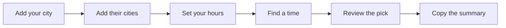

# ✨ Twine

**Finding time, together.**

Twine is a little timezone planner that answers one question:

> **When can we comfortably meet?**

<p align="center">
  
</p>

Add where everyone is, tell Twine when you work best, and it finds the moment that feels good for the most people. No spreadsheets, no UTC maths, no daylight-saving worries.

---

## Philosophy

**Complex problem → simple experience.**

Coordinating across timezones is fiddly: offsets, daylight saving, someone's 2 AM. Twine hides all of it behind one flow:



Twine stays intentionally small: no accounts, no calendar sync, no notifications, no backend. It is one file you can read in an afternoon.

---

## What it does

* **Recommends the best time**, plus two quieter alternatives, on the day you choose.
* **Understands comfort, not just conversion.** Every slot is rated for each person:

| Rating | Meaning |
| --- | --- |
| **Ideal** | Inside your chosen working hours |
| **Workable** | Outside them, but between 7 AM and 10 PM |
| **Early / Late** | Before 7 AM or after 10 PM, penalised by how far off it is |

* **Labels each option in plain words**, so there's nothing to decode:
💜 *Ideal for everyone* · 🌼 *Works for most* · 🌙 / 🌅 *Someone's compromising*.
The top pick carries a ✨ *Recommended* tag; the list order says the rest.
* **Shows a 24-hour timeline** of everyone's day: preferred hours, workable hours, your pick, and a live "now" marker.
* **Shows live local times** for each person, with UTC offsets.
* **Copies a ready-to-paste summary** of the agreed time in everyone's local time.
* **Light and dark mode**, mobile-first and responsive.
* **Accessible by default:** semantic HTML, ARIA roles, visible focus states, a fully keyboard-navigable city picker.

### Timezones done properly

* Uses the browser's built-in `Intl.DateTimeFormat` and IANA timezones, so there is **no hard-coded UTC maths**.
* Offsets are read at the **actual meeting moment**, so daylight-saving changes are handled, including days with 23 or 25 hours and Southern Hemisphere transitions.
* Handles non-hour offsets such as +5:30 (India), +5:45 (Nepal) and +6:30 (Myanmar).
* About 90 well-known cities across 5 regions, one per timezone, each with its country flag. Search understands nearby names (type "Munich" and get Berlin). Anything else is one click away via **Search all time zones**, which lists every zone your browser supports.

---

## Privacy

Twine runs entirely in your browser.

* No network requests, no analytics, no cookies, no external fonts or scripts.
* Nothing is stored or sent anywhere; close the tab and it's gone.
* The only time anything leaves the page is when *you* press **Copy**, and then it goes to your own clipboard.

---

## Run it

Twine is a single React component: [`Twine.jsx`](https://github.com/weiss-lytics/Systems-Labs/blob/main/twine/react/twine.jsx). Its only dependency is React itself.

```bash
npm install
npm run dev      # local dev server
npm run build    # static site in dist/

```

The build output is a static folder, so it deploys anywhere (GitHub Pages, Netlify, any static host). The project is configured with a relative base path so it works from a repository sub-path.

### Project layout

```text
twine/
├─ index.html
├─ vite.config.js
├─ package.json
└─ src/
   ├─ main.jsx      # mounts <Twine/>
   └─ Twine.jsx     # the whole app: logic, UI, styles

```

---

## How the recommendation works

1. Take the **day you picked**, in **your** timezone, in 30-minute steps (correct across daylight-saving days).
2. For each step, work out everyone's local time and rate each person Ideal / Workable / Early-or-Late, taking the **meeting length** into account.
3. Score the slot: ideal times score highest (closer to the middle of your hours is better), workable adds a little, early or late subtracts more the further outside 7 AM – 10 PM it falls.
4. Skip anything already in the past.
5. Take the top scorers, keeping picks at least 90 minutes apart, and show the best first.

---

## Known limitations

* Everyone shares the same working hours (yours).
* Working hours can't span midnight (for example 10 PM to 6 AM).
* "Workable" is fixed at 7 AM – 10 PM.
* Times are suggested only within the single day you choose.
* A wall-clock time that doesn't exist (the hour skipped when clocks spring forward) resolves to the nearest valid moment.
* Settings aren't saved between visits, on purpose.

---

Designed & crafted with 💜 by Weiss
